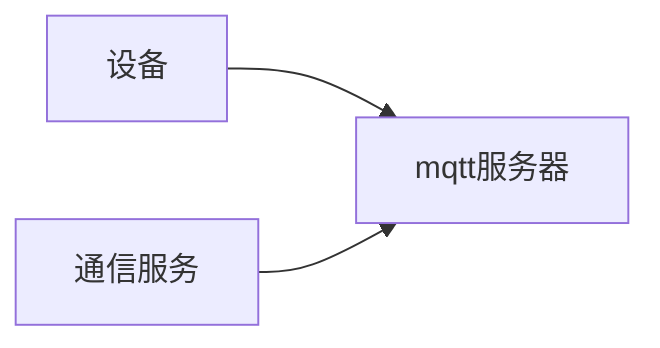

# 通信服务

该服务只做和设备进行通信的功能，设备的通信协议主要有两种，一种是 socket 通信，一种是 **mqtt** 通信。
- socket 通信采用 Netty 处理
- mqtt 就是一种消息队列，需要一个 mqtt 服务器
设备连接到 mqtt 服务器，通信服务也连接到 mqtt 服务器，通过订阅 topic 来传递消息

通信服务接收到设备发过来的各种指令对指令进行解析，然后通过 rocket mq 传递到设备服务，设备服务对这些信息进行相应的业务处理。
设备服务需要向设备发送指令信息也是需要把参数通过 mq 发送给通信服务，通信服务在对这些参数进行处理通过通信协议发送给设备以此来进行交互。

# 设备服务

设备服务主要处理关于设备上传上来解析好的数据进行业务处理。
- 比如说重量记录、心跳记录、设备上下线、设备的开关门处理，并且订单开关门后的重量计算，商品计算，库存计算，补货的重量计算，库存计算都在设备服务进行
设备服务是 app服务 和 通信服务对接的一个桥梁
- 比如说 app服务需要开门，需要在设备服务缓存开门前的重量信息，以及更新货柜的状态，查询该设备连在哪个设备服务器，找到该设备服务器进行指令的发送等等

# appp 服务

app 服务主要就是对接小程序，小程序需要的各种接口都由app 服务提供，比如说用户订单数据的查询，用户账户的查询，扫码开门购买的接口，充值的接口

# 账户服务

账户服务主要就是账户的场景以及扣款前的金额以及优惠券的计算，账户流水的计算

# 通道服务

通道服务主要就是和微信和支付宝以及第三方平台的接口对接，还有短信验证码的接口对接，对外访问的接口都是通过通道服务去完成

# 后台管理系统服务

后台管理系统服务就是后台管理系统的接口处理，提供后台管理需要的各种接口

