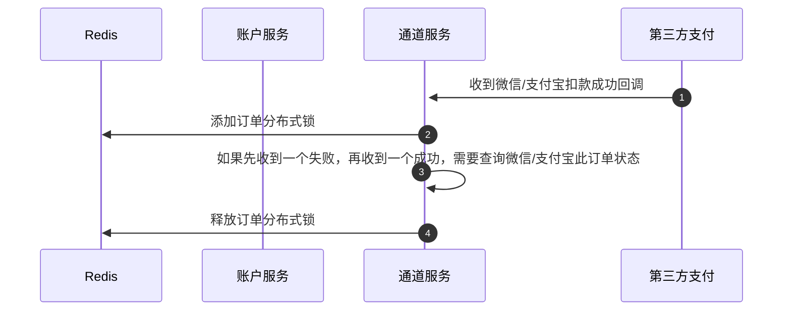

# 设备登录

1. 连上设备，设置设备连接的通信服务ip端口号或者域名
2. 连接后，通过socket/mqtt，发送登录请求，响应登录成功，调用设备服务设备信息入库，状态为初始化，将设备信息、设备链接的哪台通信服务，存入Redis缓存，开始发心跳包（数据有设备id、温度）
3. 平台收到设备心跳包后，将心跳信息存入Redis

# 设备初始化

1. 配置仓门、货道、商品等信息
2. 通知货柜修改价签
3. 校准货柜（清零 -> 放标准砝码）

# 重量信息发送

1. 如果仓门为关门状态，每 90s 发送一次
2. 如果仓门为开门状态，每 300ms 发送一次
3. 关门后 8s 内，每 300ms 发送一次

# 创建用户

- 创建用户 -> 创建账户。需要强一致，使用 Seata 的 XA 模式

# 下单流程
1. 收到用户开门请求，检查各种参数
2. 加设备分布式锁
3. 创建订单，订单状态为未操作
4. 向支付平台申请创建预授权订单
5. 创建成功之后，前端拉起支付平台预授权确认页面
6. 用户确定授权后，会收到支付平台的回调
7. 修改订单状态为预授权完成
8. 订单信息、开门前各个货道重量信息缓存Redis，通知货柜开门。同时发送延时消息检查是否开门
9. 收到关门请求后，等待一个关门后的稳定重量
10. 计算出购买的商品、购买数量、总金额
11. 释放设备分布式锁
12. 修改本地订单状态为支付中，使用Rocket MQ事务消息通知支付平台进行免密扣款，同时扣减库存计算货道是否需要补货，如果需要使用Rocket MQ消息通知运营人员进行补货
13. 收到扣款回调，如果成功修改订单状态为已支付


# 收到微信/支付宝回调



## 收到开门/关门
![[Pasted image 20240423195251.png]]

# 对账

1. 每天晚上空闲时，根据最新重量计算库存 和 现有库存进行对比，如果不对根据重量流水表看是哪个时间段哪个人买的，尝试要钱，如果不给记入损耗
2. 从第三方平台下载前一天交易账单，进行对账核算，主要订单状态、订单金额、手续费等
3. 每天生成日结算记录，插入数据库表中，根据日汇总数据表前端绘制各种图表

# 项目难题/亮点

## 问题一

设备初始化登录发送心跳时，之前是将设备唯一号为key存入Redis，设置过期时间，每次接收到心跳重新设置过期时间，通过过期监听更新设备状态。这可能因网络等服务问题，设备发送的心跳未接收到，Redis心跳缓存未续期，设备状态良好却下线。
解决：每次接收心跳包，将最后一次心跳时间也存入设备缓存中，开启一个定时任务，每隔一段时间去看设备缓存中的最后一次心跳时间，如果跟现在时间大于一定阈值，则认为设备可能不正常。同时设置一个心跳计数器，假如2000台设备1min发2次心跳，那么1min应该收到4000次心跳包，如果收到的次数小于一个阈值例如3200次，则认为服务可能出现了问题，下一次轮询的时候再去真正设置设备状态为下线，通知维修人员，反之如果服务没问题，则直接修改设备状态为下线，通知维修人员

## 亮点：JVM 调优

因为频繁发送重量信息，频繁new对象，导致Eden迅速占满，造成频繁 Full GC，使得程序变慢
修改老年代和新生代的比例，增大新增的占比；修改Eden 和 Survivor 的比例，增大 Survivor 的区域大小


# 技术使用位置

## Rocket MQ

1. 通信服务想完全做成独立的，因此和设备服务通信都是通过 Rocket MQ 消息进行通信
2. 向微信/支付宝创建预授权订单后，会发送一个 1min 的延时消息，如果到时订单状态还是未操作，则人为用户可能已经取消了操作，取消订单，取消第三方预授权订单
3. 结单时，会向通道服务发送一个 Rocket MQ 事务性消息，由通道服务去调用微信/支付宝，进行免密扣款
4. 需要补货时，会向设备服务发送一个 Rocket MQ 消息，由设备服务计算出需要补货的商品和数量之后，再发送一个 Rocket MQ 消息给通道服务通知运营人员进行补货

## Redis
### Redis 缓存

设备缓存内容

```text
设备sn
设备状态
设备类型
设备温度
加热状态
高德经纬度
腾讯经纬度
仓门信息
	仓门id
	仓门代码
	仓门状态
	货道个数
	货道信息
		货道id
		货道代码
		货道名称
		货道重量
		货道最大商品数
		补货阈值
		商品编号
		现有库存
		货道状态
最后一次心跳时间
最后一次重量时间
最后一次重量
```

### Redisson 分布式锁

1. 同一台设备下单、维修、补货、换品、改价都使用同一把分布式锁
2. 收到微信/支付宝的扣款回调，使用分布式锁保证幂等性

### Redis GEO数据类型
基于 GEO 数据类型，实现了在小程序上查看附近的货柜位置

## 分布式事务

1. 创建用户 -> 创建账户，使用 Seata 的 XA 模式，实现分布式事物的强一致性
2. 结单时，会向通道服务发送一个 Rocket MQ 事务性消息，由通道服务去调用微信/支付宝，进行免密扣款。实现了分布式事务的最终一致性


微信
小程序需确认：
https://pay.weixin.qq.com/docs/merchant/products/weixin-pay-score/development/development-true.html
创建支付分订单
https://pay.weixin.qq.com/docs/merchant/apis/weixin-pay-score/service-order/create-service-order.html
前端拉起支付分订单确认
https://pay.weixin.qq.com/docs/merchant/apis/weixin-pay-score/applets-confirm.html